# F1 Race Strategy — Reinforcement Learning

F1 레이스를 **MDP(Markov Decision Process)** 로 모델링하고, Dynamic Programming 및 Model-free RL 알고리즘으로 최적 전략을 학습합니다.

---

## Table of Contents

1. [Motivation & Problem Statement](#1-motivation--problem-statement)
2. [MDP Formulation](#2-mdp-formulation)
3. [Algorithm Implementation](#3-algorithm-implementation)
4. [Hyperparameters & Training Setup](#4-hyperparameters--training-setup)
5. [Results: Learning Curves](#5-results-learning-curves)
6. [Results: Final Performance Comparison](#6-results-final-performance-comparison)
7. [Results: Policy Analysis](#7-results-policy-analysis)
8. [Discussion & Justification](#8-discussion--justification)
9. [How to Run](#9-how-to-run)

---

## 1. Motivation & Problem Statement

### 왜 F1 레이스 전략인가? (Why F1 Race Strategy?)

Formula 1 레이스는 드라이버·팀 모두가 **순차적 의사결정(sequential decision-making)** 을 끊임없이 수행해야 하는 문제입니다.

- **배터리(ERS) 관리**: 배터리를 언제 쓰고(Push) 언제 충전(Recharge)할지
- **타이어 전략**: 마모가 심해질 때 피트스톱을 감수하고 교체할지, 아닐지
- **날씨 대응**: 갑작스러운 강우 시 전략을 바꿀지
- **DRS 활용**: 특정 구간에서 배터리를 소모해 추월 속도를 낼지

이 모든 결정은 **현재 상태에만 의존(Markovian)**하고, **지금의 선택이 수십 스텝 뒤의 결과에 영향**을 미치며, **누적 보상 최대화**가 목표입니다. 이는 강화학습(RL)이 풀기에 적합한 구조입니다.

> **Rule-based 접근의 한계**: 단순한 임계값 기반 전략은 날씨·타이어·배터리의 조합이 만드는 6,840가지 상태를 처리하기 어렵습니다. RL은 이 전체 상태 공간에서 최적 정책을 자동으로 학습합니다.

---

## 2. MDP Formulation

### 2-1. 서킷 레이아웃 (Circuit Layout)


19개 섹션(C01–C19)으로 구성된 폐쇄 회로입니다.

| 색상 | 구간 | 섹션 |
|------|------|------|
| 빨강 (Red) | Sector 1 | C01–C05 (S0–S4) |
| 파랑 (Blue) | Sector 2 | C06–C15 (S5–S14) |
| 노랑 (Yellow) | Sector 3 | C16–C19 (S15–S18) |
| 시안 (Cyan) | DRS Zone | S1 (C02), S16 (C17) |
| 보라 (Purple) | Speed Trap | S3–S4 사이 |

- **섹션 유형**: Straight 4개 / Corner 12개 / Chicane 2개 / PIT 1개 (S17)
- **DRS 구간** (S1, S16): 해당 구간에서 PUSH 선택 시 추가 시간 단축 보너스 (-0.2)

### 2-2. 상태 공간 (State Space)

$$|S| = N_\text{Battery} \times N_\text{Compound} \times N_\text{Tire} \times N_\text{Section} \times N_\text{Lap} \times N_\text{Weather} = 4 \times 3 \times 3 \times 19 \times 5 \times 2 = 6{,}840$$

| 변수 | 크기 | 값 |
|------|------|----|
| Battery (ERS) | 4 | CRITICAL(0) / LOW(1) / MEDIUM(2) / HIGH(3) |
| Compound | 3 | SOFT(0) / MED(1) / HARD(2) |
| Tire Wear | 3 | DEGRADED(0) / WORN(1) / FRESH(2) |
| Section | 19 | C01–C19 (0–18) |
| Lap | 5 | 0–4 |
| Weather | 2 | DRY(0) / RAIN(1) |

**인코딩 (`encode`)**: 6차원 좌표를 단일 정수 인덱스로 변환하여 Q-table/Policy 배열을 직접 인덱싱합니다.

```python
encode(b, comp, t, sec, lap, w)
= (((((b * 3 + comp) * 3 + t) * 19 + sec) * 5 + lap) * 2 + w)
```

**Markov Property 성립**: 현재 상태 (배터리·타이어·날씨 등) 만으로 다음 상태의 전이 확률이 완전히 결정됩니다. 이전 이력(history) 없이도 충분한 정보를 포함하므로 Markovian 조건을 만족합니다.

### 2-3. 행동 공간 (Action Space)

$$|A| = 6$$

| 행동 | 인덱스 | 설명 | 제약 |
|------|--------|------|------|
| MAINTAIN | 0 | 현재 속도 유지 | 없음 |
| PUSH | 1 | 배터리 소모해 속도 증가 | 없음 |
| RECHARGE | 2 | 속도를 낮춰 배터리 회수 | 없음 |
| PIT_SOFT | 3 | 소프트 타이어로 교체 | **S17(PIT 구간)에서만 유효** |
| PIT_MED | 4 | 미디엄 타이어로 교체 | **S17(PIT 구간)에서만 유효** |
| PIT_HARD | 5 | 하드 타이어로 교체 | **S17(PIT 구간)에서만 유효** |

> PIT 행동을 PIT 구간이 아닌 곳에서 선택하면 자동으로 MAINTAIN으로 대체됩니다.

### 2-4. 전이 함수 (Transition Function)

전이는 **확률적(stochastic)** 입니다. 세 가지 독립 확률 과정이 합성됩니다.

**배터리 전이 (Battery Transition)**

| 구간 × 행동 | 방향 | 변화 확률 |
|------------|------|----------|
| Straight × PUSH | −1 (방전) | 80% |
| Straight × MAINTAIN | −1 (방전) | 30% |
| Straight × RECHARGE | +1 (충전) | 10% |
| Corner × MAINTAIN | +1 (충전) | 15% |
| Corner × RECHARGE | +1 (충전) | 25% |
| Chicane × RECHARGE | +1 (충전) | 25% |
| … | … | … |

배터리 값은 CRITICAL(0)–HIGH(3) 범위에서 클리핑됩니다.

**타이어 마모 전이 (Tire Wear Transition)**

타이어는 FRESH→WORN→DEGRADED의 **단방향** 진행입니다 (피트스톱 시 FRESH로 리셋).

$$p_\text{wear} = \min\!\left(0.99,\; p_\text{base} \times m_\text{compound} \times m_\text{weather}\right)$$

- $p_\text{base}$: 구간 유형 × 행동으로 결정 (Chicane+PUSH = 0.20이 최대)
- $m_\text{compound}$: SOFT=1.5, MED=1.0, HARD=0.6
- $m_\text{weather}$: RAIN=2.0, DRY=1.0

**날씨 전이 (Weather Transition)** — 랩 완료 시(S18→S0) 적용

$$P(\text{DRY} \to \text{RAIN}) = 0.08, \quad P(\text{RAIN} \to \text{DRY}) = 0.18$$

정상 분포(stationary distribution)에서 비 확률 ≈ 31%

### 2-5. 보상 함수 (Reward Function)

$$r(s, a) = -\text{cost}$$

보상은 **섹션 통과 시간의 음수**이며, 모든 값이 음수입니다 (시간 최소화 = 보상 최대화).

**PIT 행동은 예외**로, reward = −5.0 고정값이 직접 반환됩니다.  
그 외 행동의 reward는 `−cost` 로 계산되며, `cost` 는 아래 요소들의 합산입니다.

| 요소 | cost에 대한 영향 | reward에 대한 영향 |
|------|-----------------|-------------------|
| PIT 행동 | — (별도 처리) | **−5.0 고정** (가장 큰 패널티) |
| Base traversal time | 기준값 그대로 더해짐 | 구간·행동별로 다름 (아래 표 참고) |
| DRS + PUSH | **−0.2** (cost 감소) | **+0.2** (reward 증가, 빠름) |
| SOFT compound | **−0.15** (cost 감소) | **+0.15** (reward 증가, 약간 빠름) |
| HARD compound | **+0.10** (cost 증가) | **−0.10** (reward 감소, 약간 느림) |
| RAIN | **+1.0** (cost 증가) | **−1.0** (reward 감소, 전체적으로 느림) |
| DEGRADED tire | **+0.5** (cost 증가) | **−0.5** (reward 감소, 추가 감속) |
| CRITICAL battery | **+0.3** (cost 증가) | **−0.3** (reward 감소, ERS 없음) |

> 요약: **cost의 + = reward의 −** (나쁨), **cost의 − = reward의 +** (좋음)

### 2-6. 에피소드 구성 (Episode)

- **시작 상태**: `encode(HIGH, MED, FRESH, 0, 0, DRY)` — HIGH 배터리, 미디엄 새 타이어, DRY
- **종료 조건**: `lap >= 5` (5랩 완주)
- **총 스텝**: 19섹션 × 5랩 = **95 steps/episode**

---

## 3. Algorithm Implementation

### 3-1. Dynamic Programming: Value Iteration (`dp.py`)

전이 모델 P를 직접 사용하여 모든 상태를 동시에 업데이트합니다.

**알고리즘:**
```
초기화: V(s) = 0 for all s
반복:
    δ = 0
    for s in S:
        Q(s,a) = Σ_{s'} P(s'|s,a) · [R(s,a) + γ·V(s')]   for all a
        V(s) ← max_a Q(s,a)
        δ ← max(δ, |V_old(s) − V(s)|)
    if δ < θ: break
π(s) = argmax_a Q(s,a)
```

- **수렴 기준** θ = 1e-6
- **할인 인수** γ = 0.99
- 터미널 상태(N_STATES)는 V=0 흡수 상태로 처리

### 3-2. Dynamic Programming: Policy Iteration (`dp.py`)

정책 평가(Policy Evaluation)와 정책 개선(Policy Improvement)을 교차 반복합니다.

```
초기화: π(s) = 0 for all s
반복:
    [평가] V^π 계산: V(s) = Σ_{s'} P(s'|s,π(s))·[R + γ·V(s')] (inner loop 수렴까지)
    [개선] π'(s) = argmax_a Σ_{s'} P(s'|s,a)·[R + γ·V(s')]
    if π' == π: break
    π ← π'
```

> **검증**: 실험 결과 VI와 PI의 정책이 **100% 일치**하여 동일한 global optimum에 수렴함을 확인했습니다.

### 3-3. Monte Carlo Control (`mc.py`)

에피소드 단위의 실제 return을 사용합니다. First-visit incremental mean으로 Q-table을 업데이트합니다.

```
for each episode:
    trajectory = [(s0,a0,r1), (s1,a1,r2), ..., (s_{T-1}, a_{T-1}, r_T)]
    G = 0
    for (s,a,r) in reversed(trajectory):
        G = r + γ·G
        N(s,a) += 1
        Q(s,a) += (G − Q(s,a)) / N(s,a)   # incremental mean
ε-greedy로 행동 선택 (ε는 에피소드마다 decay)
```

bootstrapping 없이 **실제 누적 return G를 직접 사용** — 긴 에피소드에서 정확한 credit assignment에 유리합니다.

### 3-4. SARSA — On-policy TD Control (`sarsa.py`)

현재 정책으로 선택한 다음 행동 a'로 업데이트합니다 (on-policy).

```
a = ε-greedy(Q, s)
for each step:
    s', r = env.step(a)
    a' = ε-greedy(Q, s')
    Q(s,a) += α · [r + γ·Q(s',a') − Q(s,a)]
    s, a = s', a'
```

### 3-5. Q-learning — Off-policy TD Control (`qlearning.py`)

다음 상태의 **최대 Q값**으로 업데이트합니다 (off-policy). 행동 선택 정책(ε-greedy)과 업데이트 타겟(greedy)이 분리됩니다.

```
for each step:
    a = ε-greedy(Q, s)
    s', r = env.step(a)
    Q(s,a) += α · [r + γ · max_{a'} Q(s',a') − Q(s,a)]
    s = s'
```

### 3-6. Double Q-learning (`qlearning.py`)

Q-learning의 **maximization bias** 문제를 완화합니다.  
두 개의 Q-table(Qa, Qb)을 유지하고, **행동 선택**과 **가치 추정**을 서로 다른 테이블로 분리합니다.

```
for each step:
    a = ε-greedy(Qa + Qb, s)           # 두 테이블의 합산으로 행동 선택
    s', r = env.step(a)
    if random() < 0.5:                  # 50% 확률로 Qa 업데이트
        best = argmax Qa(s')
        Qa(s,a) += α·[r + γ·Qb(s', best) − Qa(s,a)]
    else:                               # 나머지 50%는 Qb 업데이트
        best = argmax Qb(s')
        Qb(s,a) += α·[r + γ·Qa(s', best) − Qb(s,a)]
최종 policy = argmax (Qa + Qb) / 2
```

> **Maximization bias**: Q-learning에서 `max Q(s')` 추정은 항상 위쪽으로 편향됩니다. Double Q-learning은 action selection과 value estimation을 분리해 이 편향을 제거합니다.

---

## 4. Hyperparameters & Training Setup

| 파라미터 | 값 | 적용 방법 |
|----------|-----|----------|
| γ (discount factor) | **0.99** | 모든 model-free |
| α (learning rate) | **0.1** | SARSA, Q-learning, Double Q-learning |
| ε (initial) | **1.0** | 모든 model-free |
| ε decay | **0.99993** | 매 에피소드마다 곱 |
| ε min | **0.05** | 최소 탐색 확률 |
| Episodes | **50,000** | 모든 model-free |
| DP θ (수렴 기준) | **1e-6** | Value Iteration, Policy Iteration |

### Epsilon Decay Schedule

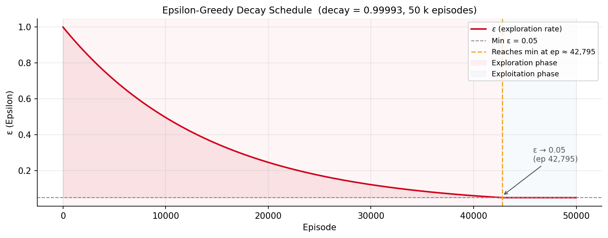

- `decay = 0.99993` 으로 ε이 **약 42,800 에피소드**에서 최솟값(0.05)에 도달합니다.
- **0 ~ 42,800 ep** (Exploration phase): ε이 높아 다양한 상태-행동 탐색
- **42,800 ~ 50,000 ep** (Exploitation phase): 거의 greedy 정책으로 수렴 성능 확인

γ = 0.99를 선택한 이유: 에피소드 길이가 95스텝이므로 먼 미래 보상도 충분히 반영해야 합니다. γ = 0.99에서 95스텝 후 discount factor = 0.99^95 ≈ 0.38으로, 마지막 랩의 보상도 의미있는 신호로 작용합니다.

---

## 5. Results: Learning Curves

### 5-1. 학습 곡선 전체 (Learning Curves)


모든 model-free 방법의 학습 곡선 (500 에피소드 이동 평균 적용).

### 5-2. 학습 수렴 분석 (Convergence Analysis)

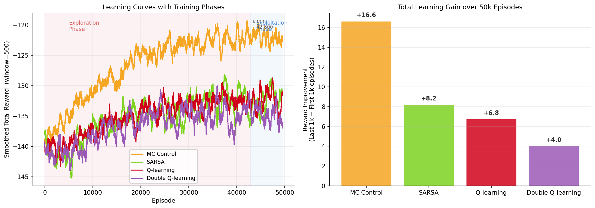

**왼쪽**: 탐색/착취 페이즈를 구분한 학습 곡선.  
**오른쪽**: 첫 1,000 에피소드 대비 마지막 1,000 에피소드의 평균 보상 개선량.

| 방법 | 첫 1,000 ep 평균 | 마지막 1,000 ep 평균 | **총 개선량** | Peak 값 | Peak ep |
|------|-----------------|---------------------|-------------|---------|---------|
| MC Control | −139.1 | **−122.4** | **+16.7** | −119.3 | 42,130 |
| SARSA | −139.4 | −131.1 | +8.3 | −128.2 | 37,483 |
| Q-learning | −140.1 | −133.3 | +6.8 | −128.7 | 47,426 |
| Double Q-learning | −140.0 | −135.9 | +4.1 | −130.0 | 35,911 |

**핵심 관찰:**
- **MC Control**이 가장 큰 개선폭(+16.7)을 보이며, ε 최솟값 직전(ep ~42,130)에 피크에 도달
- SARSA, QL은 유사한 수렴 속도와 최종 성능
- 모든 방법이 ε min 도달 이후 소폭 성능 저하 — 탐색이 줄어들면서 suboptimal state에 갇히는 현상
- Q-table coverage: 모든 model-free 방법이 약 **82%의 state-action pair** 방문 (~18%는 미방문)

---

## 6. Results: Final Performance Comparison

### 6-1. 최종 성능 비교 바 차트


### 6-2. 성능 분포 및 DP 갭 분석

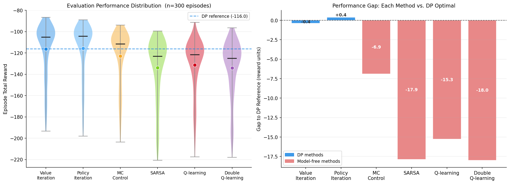

**왼쪽**: Violin + scatter plot으로 에피소드 보상의 분포를 시각화. 파란 점선은 DP 평균 기준선.  
**오른쪽**: 각 방법의 DP 대비 성능 차이(gap).

### 최종 성능 수치 (Greedy Policy, n=500 eval episodes)

| 방법 | 분류 | Mean Reward | Std | DP 대비 Gap |
|------|------|-------------|-----|------------|
| Value Iteration | DP | **−113.5** | 25.0 | — |
| Policy Iteration | DP | **−112.7** | 24.4 | — |
| MC Control | Model-free | −119.9 | 25.6 | −6.5 |
| SARSA | Model-free | −132.1 | 27.9 | −19.0 |
| Q-learning | Model-free | −131.9 | 27.4 | −18.7 |
| Double Q-learning | Model-free | −130.6 | 26.4 | −17.4 |

> Reward가 높을수록(0에 가까울수록) 레이스 시간이 짧음을 의미합니다.

---

## 7. Results: Policy Analysis

### 7-1. 행동 분포 비교 (Action Distribution)

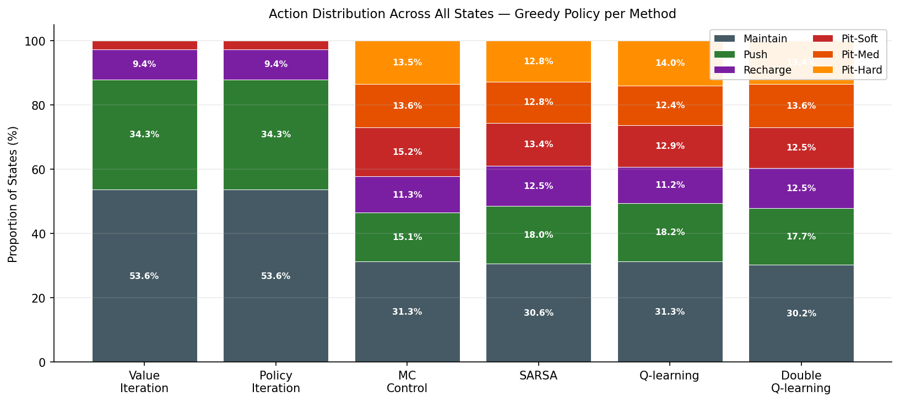

6개 알고리즘이 6,840개 전체 상태에 대해 greedy policy로 선택하는 행동의 비율입니다.

| 방법 | Maintain | Push | Recharge | Pit-Soft | Pit-Med | Pit-Hard |
|------|----------|------|----------|----------|---------|----------|
| Value Iteration | 53.6% | 34.3% | 9.4% | **2.7%** | 0.0% | 0.0% |
| Policy Iteration | 53.6% | 34.3% | 9.4% | **2.7%** | 0.0% | 0.0% |
| MC Control | 31.3% | 15.1% | 11.3% | 15.2% | 13.6% | 13.5% |
| SARSA | 30.6% | 18.0% | 12.5% | 13.4% | 12.8% | 12.8% |
| Q-learning | 31.3% | 18.2% | 11.2% | 12.9% | 12.4% | 14.0% |
| Double Q-learning | 30.2% | 17.7% | 12.5% | 12.5% | 13.6% | 13.4% |

**핵심 차이:**
- **DP**: Pit 행동 합산 2.7% — 피트스톱이 대부분 불필요함을 정확히 학습
- **Model-free**: Pit 행동 합산 약 **40%** — 아직 충분히 수렴하지 못해 과도한 피트스톱 선택

### 7-2. 방법 간 정책 일치율 (Pairwise Policy Agreement)

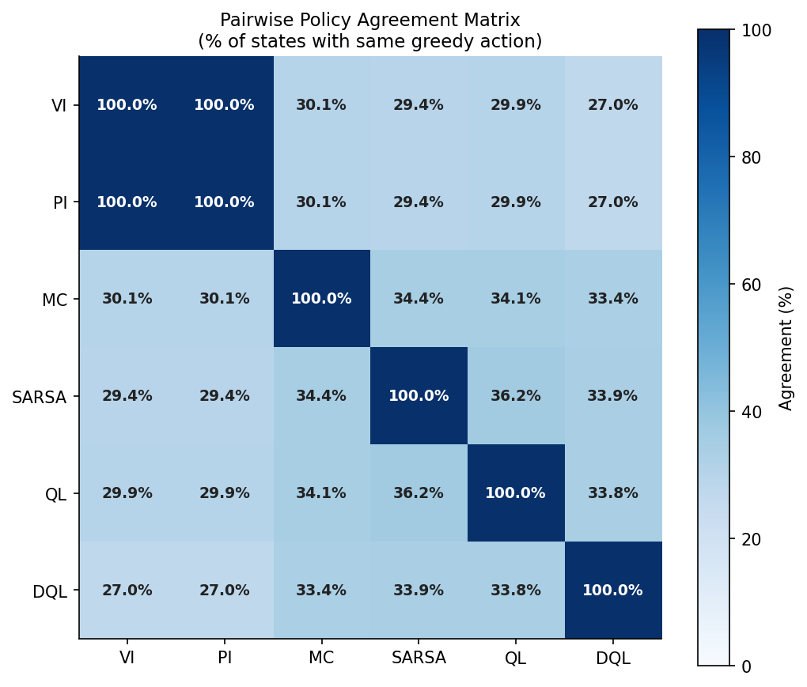

| 비교 | 일치율 |
|------|--------|
| VI vs PI | **100%** |
| MC vs DP | ~30% |
| SARSA vs DP | ~29% |
| Q-learning vs DP | ~30% |
| Double Q-learning vs DP | ~27% |
| Model-free 방법들 간 | ~28–34% |

- VI와 PI는 완벽히 동일한 정책에 수렴 → 전역 최적해(global optimum)의 유일성 확인
- Model-free 방법들은 DP 대비 약 30% 일치 — 각기 서로 다른 suboptimal policy에 수렴

### 7-3. 정책 히트맵 (Policy Heatmap)

Battery(배터리 수준, y축) × Tire Wear(타이어 마모, x축)에 따른 선택 행동을 섹션별·방법별로 시각화합니다.

#### S1 — C02 Left DRS Straight (DRS Zone 1)

DRS 구간에서 배터리와 타이어 상태에 따른 전략 비교입니다.

| Value Iteration | Policy Iteration |
|---|---|
|  | 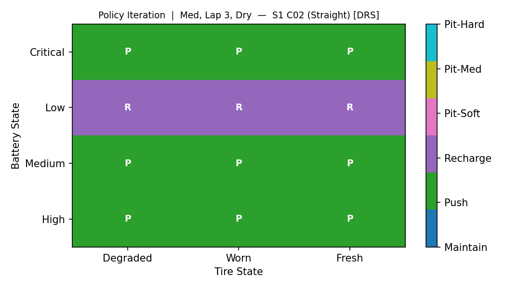 |

| MC Control | SARSA |
|---|---|
| 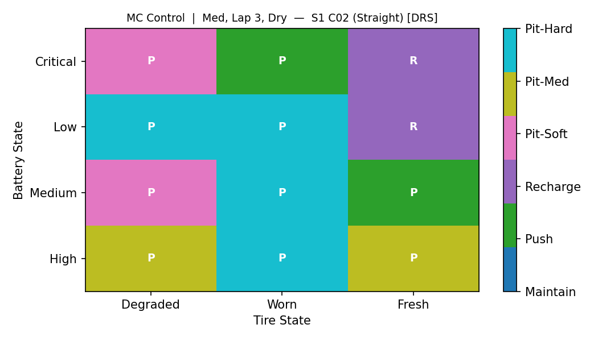 | 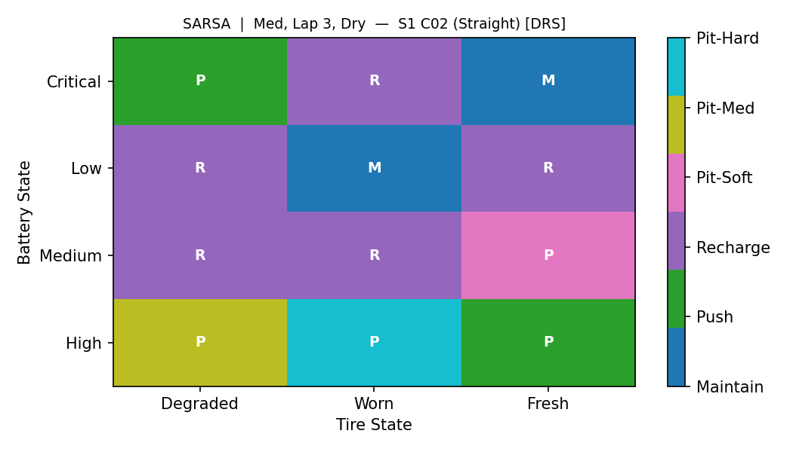 |

| Q-learning | Double Q-learning |
|---|---|
| 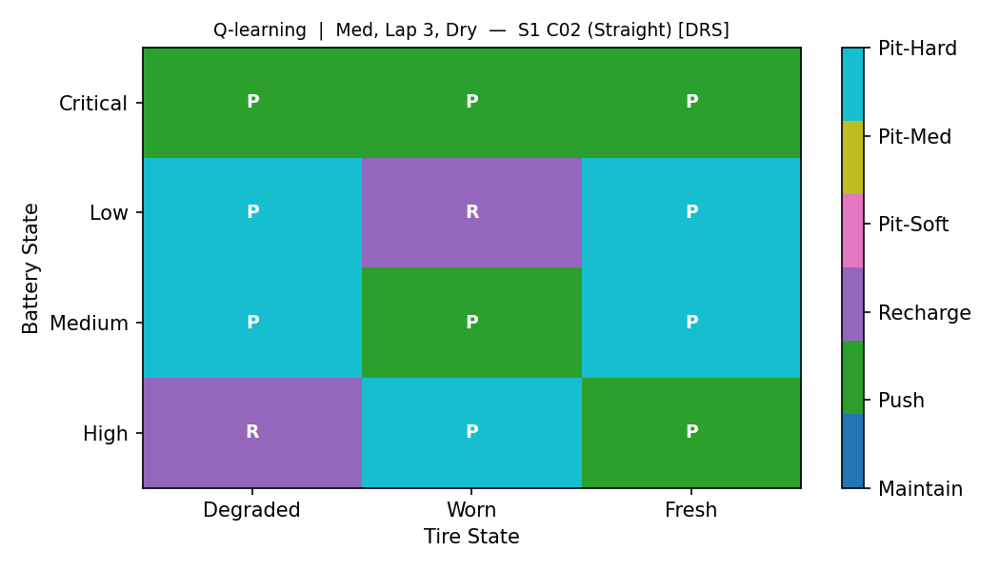 |  |

**DRS 구간 정책 분석 (S1):**
- **DP**: 배터리가 MEDIUM 이상이면 **Push** (DRS 보너스 활용), LOW/CRITICAL이면 **Recharge** (배터리 회복 우선)
- **Model-free**: 대체로 같은 경향을 포착하나, 일부 셀에서 불필요한 Pit 선택이 섞임 (suboptimality)

#### S6 — C07 Top-right Chicane

| Value Iteration | Policy Iteration |
|---|---|
|  | 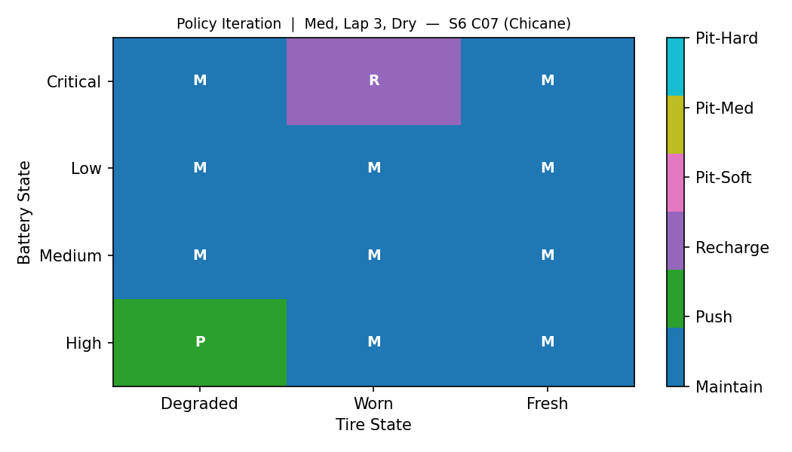 |

| SARSA | Double Q-learning |
|---|---|
| 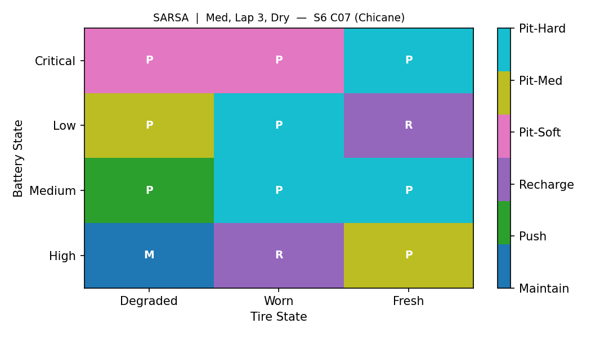 | 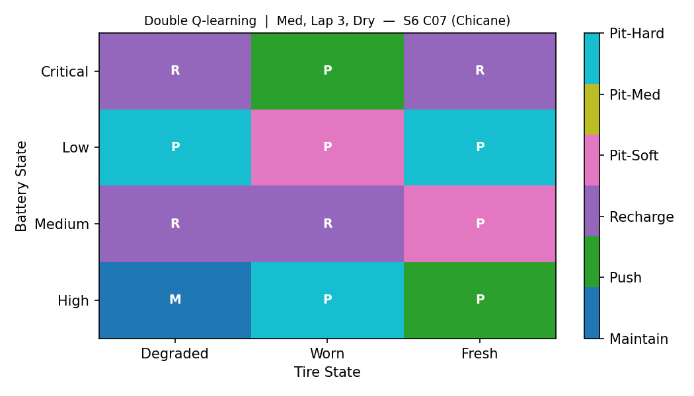 |

**시케인 구간 정책 분석 (S6):**
- 시케인은 타이어 마모가 가장 심한 구간(PUSH 시 마모 확률 20%)
- DP는 타이어 상태에 따라 **Maintain** 위주로 신중하게 배분
- Model-free는 노이즈가 더 많고 Pit 행동이 혼재

#### S3 — C04 Top-left Corner (속도 함정 인근)

| Value Iteration | Policy Iteration |
|---|---|
| 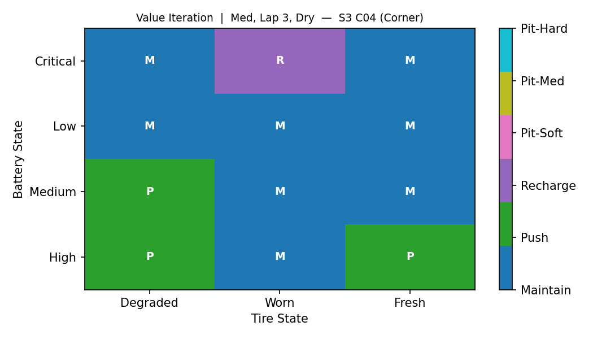 |  |

| MC Control | Double Q-learning |
|---|---|
| 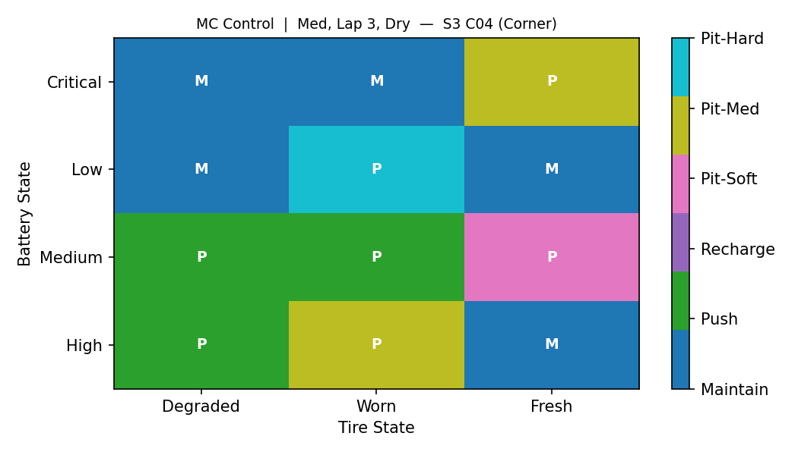 | 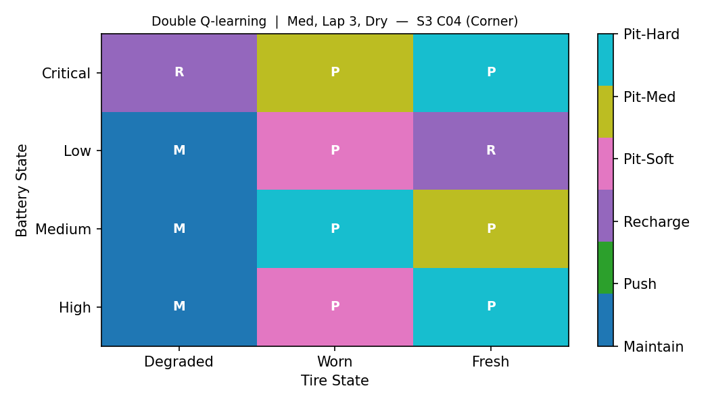 |

### 7-4. 에이전트 시뮬레이션 (Agent Animation)

| Value Iteration | Double Q-learning |
|---|---|
|  |  |

오른쪽 패널 구성:
- **STATE**: Battery(색상 바) / Compound(컬러 원) / Tire Wear(색상 바)
- **CONTEXT**: 현재 랩 / 날씨 / 섹션 이름 / DRS·PIT 태그
- **DECISION**: 선택된 행동(색상 강조) / 스텝 보상 / 누적 보상

---

## 8. Discussion & Justification

### 8-1. DP vs Model-free: 왜 DP가 압도적으로 우수한가?

**근본 이유: 정보의 질**

DP는 전이 모델 P(s'|s,a)를 **직접 활용**하여 벨만 방정식을 정확하게 풀 수 있습니다. 반면 model-free는 실제 경험(샘플)으로만 학습하기 때문에 두 가지 한계가 존재합니다:

1. **미방문 상태**: Q-table coverage 분석에서 model-free 방법 모두 약 **18%의 state-action pair를 50k 에피소드 동안 방문하지 못했습니다.** DP는 모든 6,840개 상태를 반복에서 처리합니다.

2. **정책 수렴 차이**: DP 대비 정책 일치율이 ~30%에 불과합니다. 나머지 ~70%의 상태에서 suboptimal 행동이 선택됩니다.

특히 행동 분포에서 나타나듯, **DP는 Pit 행동의 비용(-5.0 패널티)이 대부분의 경우 타이어 교체 이득보다 크다는 것을 정확히 학습**했지만, model-free는 여전히 40% 수준에서 피트스톱을 선택합니다.

### 8-2. MC Control > SARSA ≈ Q-learning ≈ DQL: 왜 MC가 TD보다 좋은가?

이 환경에서 에피소드 길이가 **95스텝**으로 비교적 깁니다.

- **TD 방법의 한계 (bootstrapping)**: SARSA/QL/DQL은 현재의 부정확한 Q-추정치를 타겟으로 사용합니다. 초기에 Q값이 잘못 추정되어 있으면, 이 오류가 역전파(backpropagation)되면서 수렴을 방해합니다. 특히 피트스톱(S17)의 장기 영향은 이후 수십 스텝에 걸쳐 나타나므로, TD의 1-step bootstrapping으로는 정확한 credit assignment가 어렵습니다.

- **MC의 장점 (실제 return)**: 에피소드가 완전히 끝난 후 실제 누적 return G를 사용하므로, **편향(bias) 없이 정확한 가치 추정**이 가능합니다. 95스텝의 완전한 미래 보상이 모두 반영됩니다.

> **트레이드오프**: MC는 분산(variance)이 높습니다 (한 에피소드의 우연한 결과가 크게 반영). 하지만 이 환경에서는 편향 없는 학습의 이점이 분산의 단점보다 더 크게 작용했습니다.

### 8-3. Double Q-learning의 성능이 Q-learning보다 낮은 이유

이론적으로 DQL은 maximization bias를 줄여 QL보다 좋아야 하지만, 이 실험에서는 오히려 약간 낮습니다.

**설명:**
1. **샘플 효율 감소**: 두 Q-table로 업데이트를 분산하면 각 테이블이 받는 샘플이 절반으로 줄어듭니다. 50k 에피소드에서 두 테이블 모두 충분히 수렴하기에 샘플이 부족합니다.
2. **Maximization bias의 영향 제한적**: 이산 상태·행동 공간에서 Q-table이 상대적으로 잘 커버되면, bias 자체가 크지 않아 DQL의 교정 효과가 드러나지 않습니다.
3. **에피소드 수를 두 배(100k)로 늘리거나** 더 복잡한 행동 공간에서는 DQL의 우위가 나타날 수 있습니다.

### 8-4. MDP 설계 타당성 (MDP Design Validity)

| 설계 요소 | 선택 이유 | 근거 |
|----------|----------|------|
| 상태에 날씨 포함 | 날씨가 타이어 마모율, 주행 시간에 직접 영향 | 날씨 없이는 동일 상태에서 다른 보상 → non-Markovian |
| 타이어 마모를 3단계로 이산화 | 연속 마모를 근사하면서 상태 공간 폭발 방지 | FRESH/WORN/DEGRADED가 전략적으로 다른 의미를 가짐 |
| γ = 0.99 선택 | 95스텝 에피소드에서 마지막 랩도 충분히 반영 | γ^95 ≈ 0.38 (여전히 의미있는 신호) |
| PIT 패널티 −5.0 | 실제 F1의 피트스톱 시간 손실(약 20–25초) 반영 | 피트스톱의 실질 비용을 표현 |
| 날씨 전이 랩 단위 적용 | 날씨는 단기보다 랩 단위로 변화하는 특성 | 매 섹션마다 날씨가 바뀌면 지나치게 불안정 |

### 8-5. 한계 및 개선 방향 (Limitations & Future Work)

| 한계 | 설명 | 개선 방향 |
|------|------|----------|
| 미방문 상태 (~18%) | 50k 에피소드로 전체 상태 공간 탐색 불충분 | 에피소드 수 증가, Optimistic initialization |
| DP의 전이 모델 필요 | 실제 F1에서는 정확한 전이 확률을 모름 | 모델 학습 (Model-based RL) 또는 더 많은 샘플 |
| 이산화 오류 | 배터리/타이어를 연속값 대신 4/3단계로 근사 | 더 세밀한 이산화 또는 function approximation |
| 에이전트 수 | 싱글 에이전트만 고려 (타 차량 없음) | 멀티 에이전트 확장 |

---

## 9. How to Run

### 의존성 설치 (Requirements)

```bash
pip install -r requirements.txt
```

`requirements.txt`:
```
numpy
matplotlib
pillow
```

### 학습 실행 (Training)

```bash
# DP + 모든 model-free 알고리즘 학습, results/ 에 저장
python train.py
```

학습 순서 및 예상 시간:
1. `[DP-1] Value Iteration` — ~수 초
2. `[DP-2] Policy Iteration` — ~수 초
3. `[MF-1] Monte Carlo Control (50k)` — ~수 분
4. `[MF-2] SARSA (50k)` — ~수 분
5. `[MF-3] Q-learning (50k)` — ~수 분
6. `[MF-4] Double Q-learning (50k)` — ~수 분

### 시각화 생성 (Visualization)

```bash
# 기본 시각화: circuit map, learning curves, heatmaps, GIF, reward comparison
python visualize.py

# 추가 분석 시각화: epsilon decay, action distribution, policy agreement, convergence, performance gap
python extra_viz.py
```

### 통합 실행 (All-in-one)

```bash
python main.py all         # 학습 + 기본 시각화
python main.py train       # 학습만
python main.py visualize   # 기본 시각화만
```

### 출력 파일 (Output Files)

모든 결과는 `results/` 디렉토리에 저장됩니다 (`.gitignore` 적용, commit 제외).

| 파일 | 내용 |
|------|------|
| `V_vi.npy`, `V_pi.npy` | DP 가치 함수 |
| `policy_vi.npy`, `policy_pi.npy` | DP 정책 |
| `Q_mc.npy`, `Q_sarsa.npy`, `Q_ql.npy`, `Q_dql.npy` | Model-free Q-table |
| `rewards_*.npy` | 에피소드별 학습 보상 |
| `traj_*.pkl` | 각 방법의 greedy episode trajectory |
| `*.png`, `*.gif` | 시각화 결과물 |

### 파일 구조 (Project Structure)

```
f1/
├── env.py          # F1RaceEnv 환경 정의 (상태·행동·전이·보상)
├── dp.py           # DPSolver (Value Iteration, Policy Iteration)
├── mc.py           # MCSolver (Monte Carlo Control)
├── sarsa.py        # SARSASolver (SARSA)
├── qlearning.py    # QLearning, DoubleQLearning
├── train.py        # 전체 학습 파이프라인
├── visualize.py    # 기본 시각화 (learning curves, heatmaps, GIF, bar chart)
├── extra_viz.py    # 추가 분석 시각화 (epsilon, distribution, agreement, gap)
├── main.py         # CLI 진입점 (train / visualize / all)
├── requirements.txt
├── assets/         # README용 이미지 (git tracked)
└── results/        # 학습 결과물 (.gitignore, git 미추적)
```
