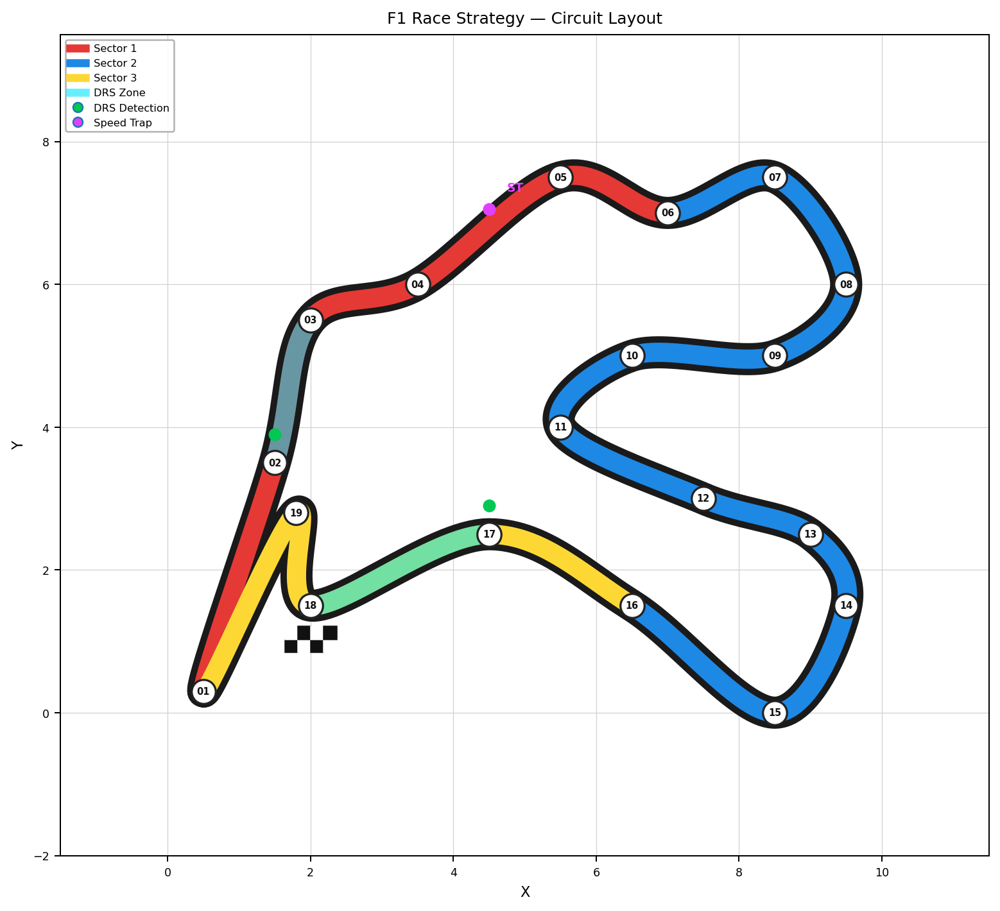
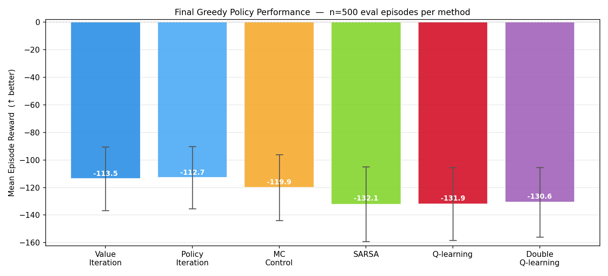
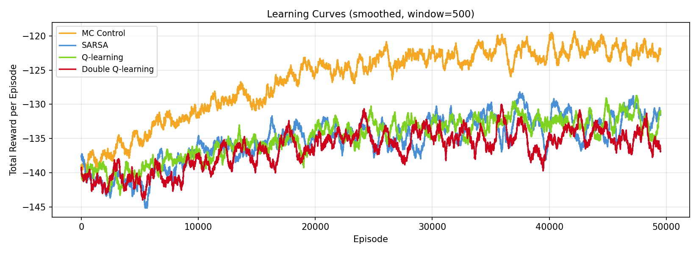
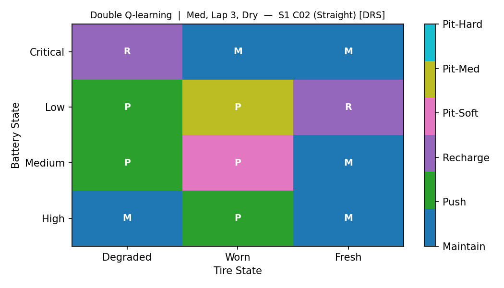
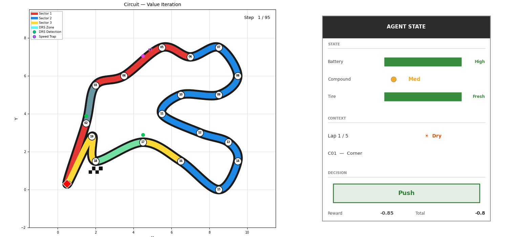

# F1 Race Strategy — Reinforcement Learning

F1 레이스를 **MDP(Markov Decision Process)** 로 모델링하고, Dynamic Programming 및 Model-free RL 알고리즘으로 최적 전략을 학습합니다.

---

## 환경 (Environment)

| 항목 | 내용 |
|------|------|
| 상태 수 | 6,840 (`Battery × Compound × Tire × Section × Lap × Weather`) |
| 행동 수 | 6 (`Maintain / Push / Recharge / Pit-Soft / Pit-Med / Pit-Hard`) |
| Reward | 섹션 통과 시간 최소화 (음수 비용) · Pit = −5.0 패널티 |
| 에피소드 | 19 섹션 × 5 랩 = 95 스텝 |

**핵심 제어 변수:** Battery(ERS) 수준 · 타이어 컴파운드 · 타이어 마모도

### Circuit Layout



> Sector별 색상 (빨강/파랑/노랑), DRS 구간(시안), Speed Trap(보라)

---

## 알고리즘

| 분류 | 알고리즘 | 특징 |
|------|----------|------|
| Dynamic Programming | Value Iteration | 전이 모델 직접 사용 |
| Dynamic Programming | Policy Iteration | 정책 평가·개선 반복 |
| Model-free | Monte Carlo Control | 에피소드 단위 complete return |
| Model-free | SARSA | On-policy TD |
| Model-free | Q-learning | Off-policy TD |
| Model-free | **Double Q-learning** | Maximization bias 완화 |

Model-free 공통 설정: `γ=0.99 · α=0.1 · ε: 1.0→0.05 (decay=0.99993, 50k episodes)`

---

## 결과

### 최종 성능 비교 (Greedy Policy, n=500 eval episodes)



| 방법 | Mean Reward | Std |
|------|-------------|-----|
| Value Iteration | **−113.5** | 25.0 |
| Policy Iteration | **−112.7** | 24.4 |
| MC Control | −119.9 | 25.6 |
| SARSA | −132.1 | 27.9 |
| Q-learning | −131.9 | 27.4 |
| Double Q-learning | −130.6 | 26.4 |

- DP 계열이 모델을 직접 활용하여 최적에 가까운 성능 달성
- MC Control이 TD 계열 대비 우위: 95-스텝 에피소드에서 완전한 return이 bootstrapping보다 credit assignment에 유리

### 학습 곡선



decay=0.99993 적용으로 ε이 ~42,800 에피소드에서 최솟값(0.05)에 도달 → 50k 에피소드 전반에 걸쳐 꾸준한 상승 추세 확인

### 정책 시각화 (Policy Heatmap)

Battery(y축) × Tire Wear(x축) → 선택 행동, 섹션/날씨/컴파운드별 고정

| Value Iteration — S1 DRS Straight | Double Q-learning — S1 DRS Straight |
|---|---|
|  |  |

- **DRS 구간**: 배터리가 충분하면 Push, Low이면 Recharge — 두 방법 모두 포착
- DP는 정책이 매끄럽고 일관적, DQL은 일부 셀에서 노이즈 존재

### 에이전트 시뮬레이션 (Animation)

| Value Iteration | Double Q-learning |
|---|---|
|  |  |

오른쪽 패널: STATE(배터리·컴파운드·타이어 마모 컬러 바) / CONTEXT(랩·날씨·섹션) / DECISION(선택 행동)

---

## 실행 방법

```bash
# 의존성 설치
pip install -r requirements.txt

# 학습 (DP + Model-free 전체)
python train.py

# 시각화 생성 (circuit map, learning curves, heatmaps, GIF, 비교 그래프)
python visualize.py
```

결과는 모두 `results/` 디렉토리에 저장됩니다.
